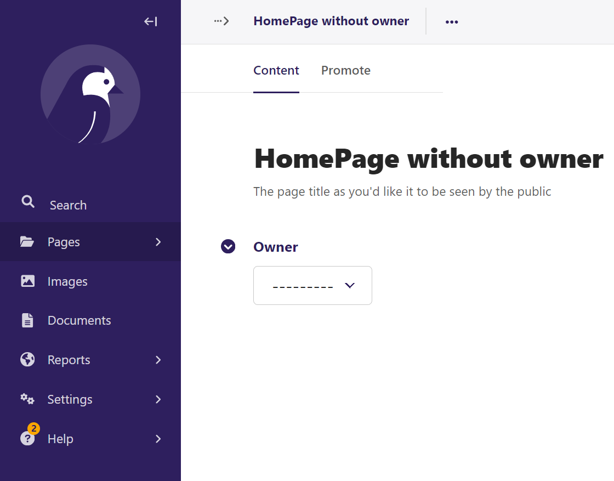

Wagtail Testing

Python version 3.12.2
Django version 5.0.2
Wagtail version 6.0.1
OS Windows 10

Clone project:
$ git clone https://github.com/weholt/wagtail-testing.git

Problems
========

1. Pages has no owner set by default. 

First checkout the testing branch:
```
$ git checkout pages_without_owner
```

To re-create use the basic model from the official wagtail tutorial and add the owner field to the content panels:

```
from django.db import models

from wagtail.models import Page
from wagtail.admin.panels import FieldPanel


class HomePage(Page):

    content_panels = Page.content_panels + [FieldPanel("owner")]
```

Enter the wagtail admin and create a new HomePage page. Check the owner field. Owner has not been assigned.

Python 3.12.2 (tags/v3.12.2:6abddd9, Feb  6 2024, 21:26:36) [MSC v.1937 64 bit (AMD64)] on win32
Type "help", "copyright", "credits" or "license" for more information.
(InteractiveConsole)
>>> from home.models import HomePage
>>> HomePage.objects.first().owner is None
True

