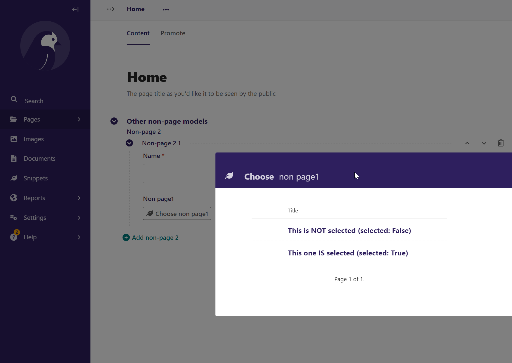
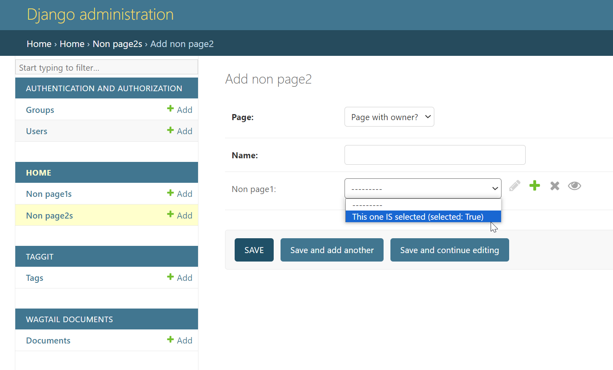

***************
Wagtail Testing
***************

- Python version 3.12.2
- Django version 5.0.2
- Wagtail version 6.0.1
- OS Windows 10

Clone main repository:

.. code-block:: bash

    $ git clone https://github.com/weholt/wagtail-testing.git

Problems
========

1. Pages has no owner set by default. 
-------------------------------------

First checkout the testing branch:

.. code-block:: bash

    $ git checkout pages_without_owner

To re-create use the basic model from the official wagtail tutorial and add the owner field to the content panels:

.. code-block:: python

    from django.db import models

    from wagtail.models import Page
    from wagtail.admin.panels import FieldPanel

    class HomePage(Page):

        content_panels = Page.content_panels + [FieldPanel("owner")]

Enter the wagtail admin and create a new HomePage page. Check the owner field. Owner has not been assigned.

.. code-block:: bash

    Python 3.12.2 (tags/v3.12.2:6abddd9, Feb  6 2024, 21:26:36) [MSC v.1937 64 bit (AMD64)] on win32
    Type "help", "copyright", "credits" or "license" for more information.
    (InteractiveConsole)
    >>> from home.models import HomePage
    >>> HomePage.objects.first().owner is None
    True

Expected behaviour
==================

HomePage.owner to be set to the user logged into the admin who created the page.

.. image:: images/Image_1.png
   :width: 600

2. Limit queryset for foreign keys using limit_choices_to not working.
----------------------------------------------------------------------

First checkout the testing branch:

.. code-block:: bash

    $ git checkout limit_choices_to_not_working

Modify the models.py file to look like this:

.. code-block:: python

    from django.db import models
    from modelcluster.fields import ParentalKey
    from wagtail.snippets.models import register_snippet
    from wagtail.admin.panels import (
        InlinePanel,
        MultiFieldPanel,
    )

    from wagtail.models import Orderable
    from wagtail.models import Page

    class HomePage(Page):

        content_panels = Page.content_panels + [
            MultiFieldPanel(
                [
                    InlinePanel("non_page2_list", label="Non-page 2"),
                ],
                heading="Other non-page models",
                classname="collapsed",
            ),
        ]

    @register_snippet
    class NonPage1(Orderable):

        text = models.CharField(max_length=50)
        selected = models.BooleanField(default=False)

        def __str__(self) -> str:
            return "%s (selected: %s)" % (self.text, self.selected)

    def query_limiter():
        return {"selected": True}

    @register_snippet
    class NonPage2(Orderable):

        page = ParentalKey(
            HomePage,
            on_delete=models.CASCADE,
            related_name="non_page2_list",
            null=True,
        )
        name = models.CharField(max_length=50)
        non_page1 = models.ForeignKey(
            NonPage1,
            on_delete=models.SET_NULL,
            limit_choices_to=query_limiter,
            null=True,
            blank=True,
        )

        def __str__(self) -> str:
            return "%s - %s" % (self.name, self.non_page1)

Log into the admin, add a couple of NonPage1 snippets, of which only a few is selected. Under the "Other non-page models"-panel of the HomePage, try to add a "non-page 2" instance, and choose a "Non page 1" instance. 

Expected behaviour
==================

The "Non page 1" list should be filtered and only show records with the select property set to True.

This works as expected in the django admin:

Installed packages / pip freeze
-------------------------------

.. code-block:: bash

    anyascii==0.3.2
    asgiref==3.7.2
    beautifulsoup4==4.12.3
    certifi==2024.2.2
    charset-normalizer==3.3.2
    defusedxml==0.7.1
    Django==5.0.2
    django-filter==23.5
    django-modelcluster==6.2.1
    django-permissionedforms==0.1
    django-taggit==5.0.1
    django-treebeard==4.7.1
    djangorestframework==3.14.0
    draftjs-exporter==5.0.0
    et-xmlfile==1.1.0
    filetype==1.2.0
    html5lib==1.1
    idna==3.6
    l18n==2021.3
    laces==0.1.1
    openpyxl==3.1.2
    pillow==10.2.0
    pillow_heif==0.15.0
    pytz==2024.1
    requests==2.31.0
    six==1.16.0
    soupsieve==2.5
    sqlparse==0.4.4
    telepath==0.3.1
    tzdata==2024.1
    urllib3==2.2.0
    wagtail==6.0.1
    webencodings==0.5.1
    Willow==1.8.0